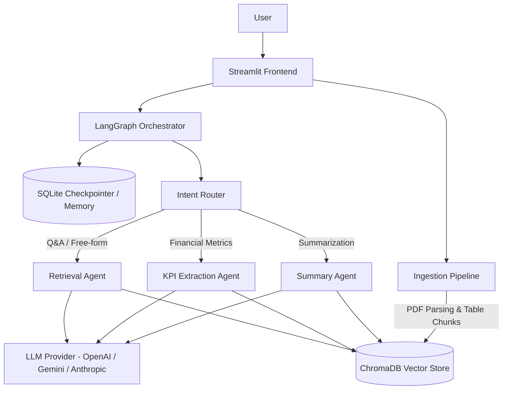

# 📊 AI Financial Document Q&A Assistant

An intelligent, document-grounded RAG (Retrieval-Augmented Generation) application designed to analyze dense financial reports, balance sheets, and annual reports. Powered by **LangGraph**, **LangChain**, **ChromaDB**, **SQLite**, and **Streamlit**.

---

## 🛠️ Required Tools & Prerequisites

Before running the project, ensure you have the following software installed:

| Tool | Recommended Version | Purpose |
| --- | --- | --- |
| **VS Code** | Latest | Recommended IDE for development and debugging |
| **Python** | `3.10` or higher | Core programming runtime |
| **SQLite3** | `3.x` (built into Python) | Used by LangGraph `SqliteSaver` for conversation state persistence |
| **Git** | `2.x+` | Version control |
| **LLM Provider API Key** | OpenAI / Gemini / Anthropic | OpenAI (`gpt-4o-mini`) is enabled by default |

---

## 🏗️ Architecture Overview

The system employs a **multi-agent workflow** orchestrated by **LangGraph** to handle distinct financial document tasks without hallucination.



### Core Architecture Components

1. **Ingestion Pipeline (`backend/ingestion/`)**:
   - Parses uploaded financial PDFs using `pdfplumber` to preserve multi-column tables and narrative alignment.
   - Uses table-aware chunking (`chunker.py`) to prevent mid-table splits.
   - Embeds document text into **ChromaDB** with page-level metadata.

2. **LangGraph Multi-Agent Orchestrator (`backend/agents/`)**:
   - **Intent Router (`router.py`)**: Classifies user queries into Q&A, KPI extraction, or summarization.
   - **Retrieval Agent (`retriever.py`)**: Fetches relevant chunks from ChromaDB and answers questions with precise page citations.
   - **KPI Extractor Agent (`kpi_extractor.py`)**: Uses Pydantic structured output models (`revenue`, `cogs`, `gross_margin`, `net_income`, `eps`, `total_assets`, `total_liabilities`, `total_equity`, `yoy_revenue_growth`) to prevent numeric hallucination.
   - **Summary Agent (`summarizer.py`)**: Produces structured executive summaries or section breakdowns.

3. **Conversational Memory (`backend/memory/checkpointer.py`)**:
   - Backed by **SQLite** (`SqliteSaver`) to persist conversation threads and state across application reruns and turns.

4. **Frontend (`app.py`)**:
   - Interactive **Streamlit** dark-themed UI featuring a multi-tab view (Chat Interface & KPI Dashboard).

---

## 📁 Directory & File Structure

```text
finance-report-rag-project/
├── app.py                      # Main Streamlit web application interface
├── requirements.txt            # Python package dependencies
├── .env.example                # Template for environment configuration
├── .gitignore                  # Git ignore rules
│
├── backend/                    # Core application backend logic
│   ├── agents/                 # LangGraph agents and workflow nodes
│   │   ├── graph.py            # LangGraph state graph definition & compiler
│   │   ├── router.py           # Intent routing node
│   │   ├── retriever.py        # Q&A retrieval agent node
│   │   ├── kpi_extractor.py    # Structured KPI extraction agent node
│   │   ├── summarizer.py       # Summarization agent node
│   │   └── state.py            # TypedDict state structure for LangGraph
│   │
│   ├── core/                   # System configuration and foundation
│   │   ├── config.py           # Pydantic/Environment configuration settings
│   │   ├── llm_provider.py     # LLM provider factory (OpenAI, Gemini, Anthropic)
│   │   └── logger.py           # Structured logging setup
│   │
│   ├── ingestion/              # Document processing & embedding pipeline
│   │   ├── parser.py           # PDF parsing with table extraction
│   │   ├── chunker.py          # Table-aware text chunking strategy
│   │   ├── vector_store.py     # ChromaDB collection management & embedding
│   │   └── pipeline.py         # End-to-end ingestion pipeline runner
│   │
│   └── memory/                 # Conversational state checkpointer
│       └── checkpointer.py     # SQLite and Memory checkpointer factory
│
├── data/                       # Document storage & sample generators
│   ├── sample_annual_report.pdf# Pre-packaged sample financial document
│   └── generate_sample.py      # Script to generate synthetic sample PDFs
│
├── metadata/                   # Project documentation & specs
│   └── architecture.md         # Detailed technical architecture design
│
├── scripts/                    # Utility & benchmark generation scripts
│   └── generate_benchmark_dataset.py
│
└── tests/                      # Automated test suite (pytest)
    ├── test_chunker.py         # Unit tests for table chunking
    ├── test_kpi_schema.py      # Validation tests for KPI Pydantic schemas
    └── test_integration.py     # End-to-end RAG pipeline integration tests
```

---

## 🚀 How to Set Up and Run

### 1. Clone the Repository & Open in VS Code

Open terminal or PowerShell and navigate to your workspace:

```bash
git clone <repository-url>
cd finance-report-rag-project
code .
```

### 2. Create & Activate a Python Virtual Environment

**Windows (PowerShell):**
```powershell
python -m venv .venv
.\.venv\Scripts\Activate.ps1
```

**Linux / macOS:**
```bash
python3 -m venv .venv
source .venv/bin/activate
```

### 3. Install Required Dependencies

```bash
pip install --upgrade pip
pip install -r requirements.txt
```

### 4. Configure Environment Variables

Copy the example `.env` file and configure your API keys:

**Windows (PowerShell):**
```powershell
Copy-Item .env.example .env
```

**Linux / macOS:**
```bash
cp .env.example .env
```

Edit `.env` in VS Code to supply your API Key (e.g. OpenAI):

```ini
OPENAI_API_KEY=sk-proj-your-openai-api-key-here
LLM_PROVIDER=openai
OPENAI_CHAT_MODEL=gpt-4o-mini
CHROMA_PERSIST_DIR=./chroma_db
SQLITE_CHECKPOINT_PATH=./checkpoints.db
ENABLE_SESSION_PERSISTENCE=true
LOG_FILE=./logs/app.log
```

### 5. Launch the Streamlit Application

Run the application using Streamlit:

```bash
streamlit run app.py
```

The application will launch in your browser at `http://localhost:8501`.

---

## 🧪 Testing & Data Generation

### Generate Synthetic Test PDF
To generate a sample financial report PDF for testing:
```bash
python data/generate_sample.py
```

### Run Automated Tests
To run unit and integration tests using `pytest`:
```bash
pytest
```

---

## 💻 Tech Stack Summary

- **Frontend**: Streamlit
- **Agent Framework**: LangGraph
- **RAG & Loaders**: LangChain, `pdfplumber`
- **Vector Database**: ChromaDB
- **State Checkpointer / Storage**: SQLite3
- **Testing**: PyTest
