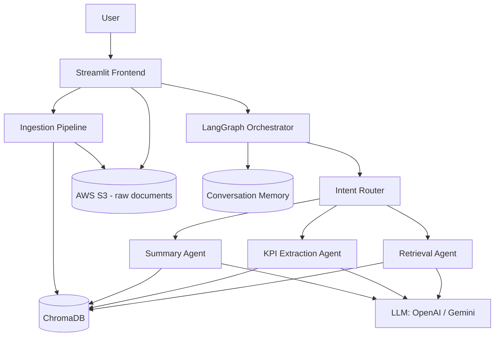
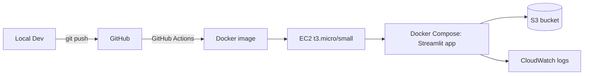

# AI Financial Document Q&A Assistant
## Technical Architecture and Implementation Plan

## 1. Project Overview

Theme: AI Financial Document Q&A Assistant

Problem statement: users struggle to understand financial reports. Dense annual reports and balance sheets bury the numbers people actually care about (revenue, margins, growth) inside pages of narrative and tables.

What the product does: a document-grounded assistant that lets a user upload a financial report (real or a practice "fake" balance sheet), then ask it questions, get an executive summary, or pull out key financial metrics, all answered with citations back to the source document.

This maps cleanly onto your existing GenAI stack (LangChain, LangGraph, CrewAI, RAG, AWS) and fits the same portfolio pattern as your other RAG document chatbot work, so most of the build is applying known tools to a new domain rather than learning new ones. The financial domain adds two genuinely hard problems worth calling out to an interviewer: table-heavy PDF parsing, and structured numeric extraction without hallucination.

## 2. Requirements

### 2.1 Functional Requirements

- Upload a financial document (PDF): annual report or balance sheet, including synthetic/practice documents.
- Ask free-form questions about the document and get answers grounded in retrieved passages, with citations (page/section).
- Request a summary of the whole report or a specific section (financial summarization).
- Extract structured KPIs: revenue, COGS, gross margin, net income, EPS, total assets/liabilities/equity, YoY growth where derivable.
- Multi-turn conversation: follow-up questions should use prior context ("what about last year?").
- Multi-agent workflow: a Retrieval Agent, a KPI Extraction Agent, and a Summary Agent, coordinated by an orchestrator rather than one monolithic prompt.

### 2.2 Non-Functional Requirements and Assumptions

The source images don't specify scale, budget, or SLA, so these are assumptions to confirm before locking the design:

- Scale: single-user / small demo audience (portfolio project, not production SaaS). Design should not need re-architecting to demo to 5-10 concurrent users, but isn't built for real traffic.
- Budget: low tier, target under $10-15/month steady state, using AWS free tier where possible.
- Response time: a few seconds per answer is acceptable; this isn't a low-latency system.
- Availability: no formal SLA. Basic uptime during demo/interview windows is enough.
- Security: uploaded documents should be treated as potentially sensitive even if synthetic, so private storage and no public document listing.

If any of these assumptions are wrong (e.g., you want this multi-tenant and public), the vector store and deployment choices below would need to change.

## 3. System Architecture

### 3.1 High-Level Architecture

### 3.2 Component Breakdown

Frontend (Streamlit): file upload widget, chat interface, and a small "KPI dashboard" panel that renders extracted metrics as a table once available. Streamlit is fine for a single-process MVP; a FastAPI backend split is listed as an optional evolution in section 12, not required for v1.

Ingestion pipeline: runs once per uploaded document.
1. Save the uploaded PDF, push a copy to S3 (private bucket, prefixed by session ID).
2. Parse text and tables. Plain text extraction (PyMuPDF or pdfplumber) handles narrative sections; financial statement tables need a table-aware extractor (pdfplumber's table mode or unstructured.io) since naive text extraction mangles multi-column numeric tables.
3. Chunk the text, keeping table boundaries intact rather than splitting mid-table (a recursive splitter with a larger chunk size for table blocks works better than a fixed-size splitter here).
4. Generate embeddings and upsert into ChromaDB with metadata (document ID, page number, section type: narrative vs table).

Orchestrator (LangGraph): a small state graph with an intent router as the entry node. The router classifies the incoming message as a retrieval question, a KPI request, or a summarization request, and routes to the matching agent node. State is shared across nodes (conversation history, active document ID, any KPIs already extracted this session, so KPI extraction doesn't re-run needlessly on follow-up questions).

### 3.3 The Three Agents

Retrieval Agent: embeds the query, does a similarity search against ChromaDB (top-k, k around 5-8), optionally reranks results, and returns the answer with citations to source page numbers. This is the default path for open-ended questions.

KPI Extraction Agent: rather than asking the LLM to "find the revenue number" in free text (which invites hallucination on financial data), this agent uses structured output (a Pydantic schema with fields like revenue, net_income, eps, total_assets, each with a value and a source_page) via function calling. The LLM is constrained to either fill a field from evidence in the retrieved chunks or mark it as not found, rather than inventing a number. Cross-check candidate values that appear more than once in the document (e.g., a number in both a summary table and the notes) as a lightweight confidence signal.

Summary Agent: for whole-report summaries, use map-reduce summarization (chunk-level summaries combined into a final summary) rather than stuffing the whole document into one prompt, since annual reports routinely exceed context windows. For section-level summaries, a single retrieval-then-summarize pass is enough.

### 3.4 Conversational Memory

Use LangGraph's built-in checkpointer rather than building custom memory handling. For local development, an in-memory saver is enough. For the deployed version, back it with SQLite (a file in the container, or on an EC2 attached volume) so a container restart doesn't silently lose an in-progress conversation. Redis is not necessary at this scale, it would be over-engineering for a single-process demo app; note the option in section 12 if this evolves to a real multi-user product.

## 4. Technology Stack

| Layer | Choice | Notes |
|---|---|---|
| Agent framework | LangGraph | Explicit state graph fits the router-plus-three-agents design better than CrewAI's role-based crews for this size of workflow |
| LLM | OpenAI or Gemini, cost-tier model | Pick whichever you already have API access/credits for; verify current pricing before committing, this changes often |
| RAG orchestration | LangChain | Document loaders, text splitters, retriever interfaces |
| Vector database | ChromaDB | Persistent, file-backed, no separate service to run; FAISS is a fine alternative if you want zero external dependency, but Chroma's metadata filtering is convenient for citing page numbers |
| PDF/table parsing | pdfplumber (+ unstructured.io if tables are messy) | Not in the original tool list but necessary; naive PyPDF-style extraction will mangle balance sheet tables |
| Frontend | Streamlit | Matches the given stack, fastest path to a working demo |
| Storage | AWS S3 | Raw uploaded PDFs, private bucket |
| Deployment | AWS EC2 | Single instance, Docker Compose |
| Containerization | Docker | Optional per the brief, but recommended even for a single-service demo since it makes the EC2 deployment reproducible |

## 5. Frontend and Interaction Design

Single Streamlit app with three views in one page: an upload panel, a chat panel, and a KPI table that populates once extraction has run. Keep it a single process for v1: Streamlit calling the LangGraph orchestrator directly in-process, no separate backend API. This avoids a network hop and a second service to deploy, and is still enough to demonstrate the multi-agent architecture clearly in an interview.

## 6. Security Considerations

- S3 bucket set to private, block all public access, server-side encryption enabled by default.
- API keys (OpenAI/Gemini) kept out of the repo, injected via environment variables on the EC2 instance or AWS Systems Manager Parameter Store, never hardcoded or committed.
- Uploaded documents are session-scoped; delete or expire them after some period rather than accumulating indefinitely (a lifecycle rule on the S3 prefix handles this without custom code).
- No auth is required for a personal demo, but if you share the EC2 URL publicly during a job search, put a simple password gate in front of Streamlit so you're not paying for strangers' LLM calls. This is also a natural place to reuse your token bucket rate limiter project: wrap the LLM-calling endpoints with it to cap cost exposure per session, which doubles as a talking point connecting two portfolio projects.

## 7. Deployment Architecture

### 7.1 Infrastructure

Single EC2 instance (t3.micro qualifies for free tier in the first 12 months, t3.small if ChromaDB and PDF parsing need more headroom), running the app via Docker Compose. Compose keeps this to one `docker-compose up` on the instance rather than manual process management, and makes the local dev environment match production.

### 7.2 CI/CD

GitHub Actions on push to main: build the Docker image, push to ECR (or just pull the repo and rebuild on the instance directly for something this small, which avoids ECR costs entirely). SSH into EC2 as the deploy step, pull the latest image or repo, `docker-compose up -d --build`. This is simple enough not to need a full pipeline tool at this scale.

### 7.3 Cost Estimate (monthly, low-traffic demo usage)

| Item | Estimated cost |
|---|---|
| EC2 t3.micro (free tier, 12 months) | $0, then ~$7-8/mo after |
| S3 storage (a few GB of PDFs) | under $1 |
| LLM API calls (demo-scale usage) | $2-10 depending on model and volume |
| Data transfer | typically negligible at this scale |
| Total | roughly $0-15/month |

## 8. Testing Strategy

Following your existing pytest habit: unit tests for the PDF parsing and chunking functions (does a known sample balance sheet produce the expected table boundaries), unit tests for the KPI extraction schema validation, and a small integration test that runs the full ingest-then-query pipeline against a fixture document with known expected answers. A basic RAG evaluation set (10-15 question/expected-answer pairs against a fixed test document) is worth building early, since "how do you know your RAG system actually works" is a common interview question this project can answer concretely.

## 9. Implementation Roadmap

| Phase | Scope | Rough effort |
|---|---|---|
| 0 | Repo setup, AWS account/keys, LLM API keys, base Docker skeleton | 0.5 day |
| 1 | Ingestion pipeline: upload, parse, chunk, embed, store in Chroma | 2-3 days |
| 2 | Retrieval Agent + basic single-agent Q&A working end to end | 1-2 days |
| 3 | LangGraph orchestrator with intent router, add KPI Extraction and Summary agents | 3-4 days |
| 4 | Conversational memory (checkpointer), multi-turn follow-ups | 1 day |
| 5 | Streamlit UI polish: chat view, KPI table, upload flow | 1-2 days |
| 6 | Dockerize, deploy to EC2, wire up S3 | 1-2 days |
| 7 | CI/CD, evaluation test set, README, security hardening (rate limiter, private bucket) | 2 days |

Total: roughly 2-2.5 weeks of part-time effort, which lines up with a portfolio project timeline rather than a full production build.

## 10. Risks and Mitigations

- Numeric hallucination on KPIs: mitigated by structured output schemas that force "not found" over guessing, plus cross-referencing repeated values.
- Table parsing quality on real-world annual report PDFs is inconsistent: budget time to test against 2-3 real annual reports, not just clean synthetic ones, since messy tables are where this breaks.
- LLM cost creep if this gets shared publicly during interviews: mitigated by the rate limiter and a password gate.
- EC2 t3.micro RAM may be tight if PDF parsing and embedding generation run in the same process as the web app under load: fallback is a t3.small, still inexpensive.

## 11. Portfolio and Interview Notes

This project's strongest talking points are the ones that go beyond "I called an LLM API": the router-based multi-agent design (why LangGraph over a single prompt), the structured-extraction approach to avoid hallucinating financial numbers, and the table-aware chunking decision. Those are the details worth having ready to explain, since they show judgment rather than just tool usage.

## 12. Future Enhancements (not needed for v1)

- Split Streamlit and orchestration into separate FastAPI backend + frontend if this needs to scale to multiple concurrent users.
- Swap SQLite-backed memory for Redis if moving to multi-instance deployment.
- Add a RAGAS-based automated evaluation pipeline instead of the manual test set.
- Support multiple documents per session with cross-document comparison ("compare this year's report to last year's").
